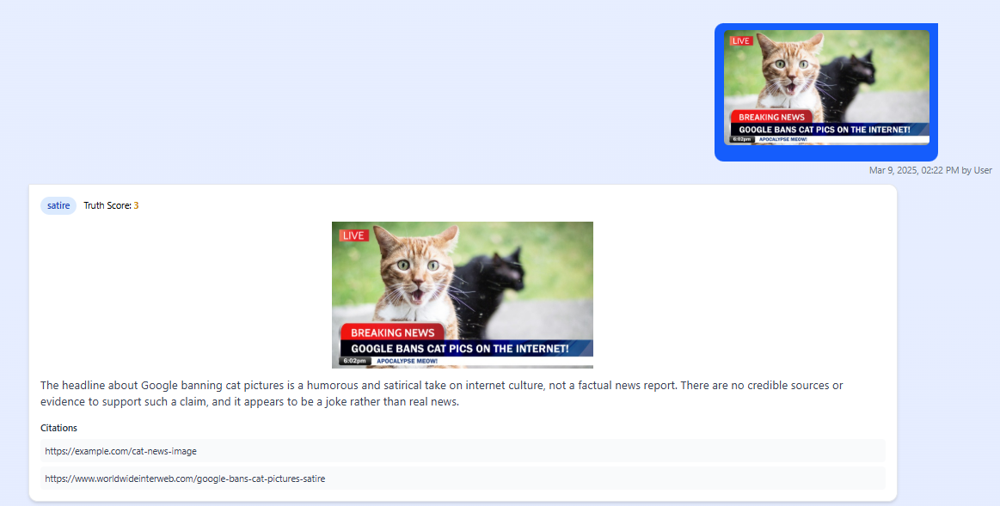

<div align = "center">
<h1> 🌏 FactFinder: Find your truth in a sea of information</h1>
</div>

## 👉 Preserve Digital Integrity: Combating Misinformation with AI
In today's information-rich society, the continuous surge of available information has also led to an increasing spread of misinformation, myths, and unverified claims. Furthermore, the presence of social media and online platforms greatly facilitate this process, as each user can easily create and disseminate information. In the context of such a rapid spread of disinformation, the problem of identifying and refuting it becomes extremely important. Fake news, or deliberately fabricated false information, is used to mislead the audience or manipulate public opinion, which can
have serious consequences for society. 

For instance, during the COVID-19 pandemic, misinformation spread rapidly, which causes further uncertainty and widespread anxiety. False claims about treatments, vaccines, and preventive measures proliferated on social media, often complicating public health efforts. This surge of misinformation posed significant challenges, undermining trust and potentially endangering public health responses.

Therefore, to combat disinformation, there is a need to develop effective tool to streamline and automate fact-checking.

## 🌍 About
Traditionally, fact-checking methods were manual, requiring human experts meticulously verifying each and every piece of information and providing justification to ensure credibility. Typically, professional fact checkers will begin by examining the original claim. They, then conduct thorough research, by consulting on reputable online resources to acquire necessary context and background. Equipped with these insights, the fact-checkers subsequently assess the accuracy of the claim and provide informed responses to users.

With the advancements in large language models (LLMs), such as OpenAI's GPT-4o-mini, it introduces powerful reasoning capabilities, enabling automated classification of messages and providing clear justifications for their assigned labels. 

As LLMs like GPT-4o-mini have proved its advanced capabilities such as:
- Generating coherent and contextually relevant text, making them invaluable in providing explanations
- Accurately naunces and linguistics unique to the language
- Sophisticated understanding of language allows them to anlayse and detech emotional tone within texts

This further exemplifies LLM's strong reasoning capabilities. Not only that, LLM today have the ability to execute actions with the help of provided “tools” via function calls.

This shift significantly streamlines and automates the fact-checking process, while enhancing accuracy and efficiency in combating misinformation.

Therefore, our primary objective is to closely replicate the workflows of these expert fact-checkers through automation. By doing so, we aim to significantly reduce the tedious and labour-intensive aspects of manual fact-checking, and reducing the time needed to provide justification to users, enhancing efficiency and reliability in the verification process.

**FactFinder**, our proposed solution, utilises LLM with Multiagentic framework to analyse text inputs or images to allow the Agents to act as factcheckers that helps users to classify their messages. 

By harnessing the powerful reasoning capabilities of OpenAI's GPT-4o-mini model, and designing an agentic workflow, we equip our agents with essential tools, including GoogleSearchAPI, PubMedAPI and ArxivAPI. These tools empower agents to efficiently search for the latest information, ensuring they can deliver accurate and up-to-date assessments of user-submitted claims. 

## 🚀 Multi-Pronged Approach
### 1. Simple and Intuitive Landing Page
<p align="center">
  </img>
  </img>
</a>
</p>

### 2. Search Feature 
<p align="center">
  </img>
  </img>
  </img>
  </img>
</a>
</p>

## 📌 Technical Stack
### 🤖 FrontEnd
 

### 🤖 BackEnd GenAI
    

### 🤖 BackEnd


### 🤖 Database


<hr>

## Getting Started

**Important Prerequisites:**

* Docker installed on your system.

**Steps to Run:**

1.  **Start the Backend Services and MongoDB:**
    ```bash
    docker-compose up --build
    ```
    This command will build the backend services (including the GenAI and SpringBoot components) and start the MongoDB container using Docker Compose.

2.  **Start the Frontend:**
    ```bash
    cd frontend
    npm run dev
    ```
    Navigate to the `frontend` directory and start the React development server.


## 🗺️ Our Tech Approach using Artificial Intelligence
### 🚂 Large Language Models 
- GPT-4o-mini: GPT-4o-mini is a multimodal Large Language model equipped with sophisticated capabilities that accepts inputs of any combination such as text, audio and image outputs. We uses both the text and image as input to predict and analyse the text and image contents. 

### 🛫 Limitations of Large Language Model (LLMs)
While GPT-4o-mini has demonstrated strong reasoning capabilities—particularly excelling in mathematical reasoning and coding tasks, and outperforming many other small models on the market, the issue of hallucinations still remains unresolved. Hallucinations in Large Language Models (LLMs) occur when generated text appears coherent and contextually relevant but contains factually incorrect or misleading information.

Considering users will interact with our web application to inquire about the latest news or recent information, it is essential to ensure that the LLM provides accurate, timely responses. Relying solely on GPT-4o-mini's pretrained knowledge inherently limits the scope and freshness of information, thereby increasing the likelihood of hallucinations.

To mitigate this issue effectively, we must integrate a structured and continuously updated knowledge base into the LLM’s inference process. This approach enhances factual accuracy and reduces hallucinations by grounding the model's responses in verified, current, and contextually appropriate data.

### Our Approach - Agent Architecture 
The main idea is to create an agentic workflow where we task the Agent to plan and execute tool calling to multiple web search functions. Each agent will have its own prompt, LLM and a set of tools where it is able to invoke. 

We created an FactChecker Agent where the agent is task to classify the messages and provide its justification to the category assigned. The FactChecker Agent we created is also provided with a set of Web Search Tool (WikipediaAPI, WikidataAPI, ArxivAPI, PubMedAPI, GoogleSearchAPI, DuckDuckGoSearchAPI).

Whenever a new message is received, the agent will be first called to decide if we should use tools. Based on the agent (LLM) decision, it will run a loop:
1. If the agent said to take an action (i.e. call tool via API), we will run the tools and pass the results back to the agent
2. If the agent did not ask to run tools, we will finish (respond to the user)

<p align="center">
  </img>
</a>
</p>

This enables AI agents to operate autonomously, make complex decision based on the context provided, and to adapt to changing environment in order to further streamline the automated fact checking process. 

To learn more about the Agent Architecture, please refer [here](https://github.com/weiyuan12/TechFest-25/tree/main/genai).

## Future Works 
One of the key objectives moving forward is to further enhance the chatbot, allowing users to interact directly with our LLM. This enhancement will enable users not only to verify claims through the chatbot but also to engage in dynamic conversations to gain deeper insights and understanding about various topics.

Furthermore, integrating our agentic workflow into popular messaging platforms such as Telegram or WhatsApp will provide users with greater convenience. This integration would allow users to easily and quickly submit uncertain claims directly through these familiar messaging applications, significantly improving the accessibility and user experience.

