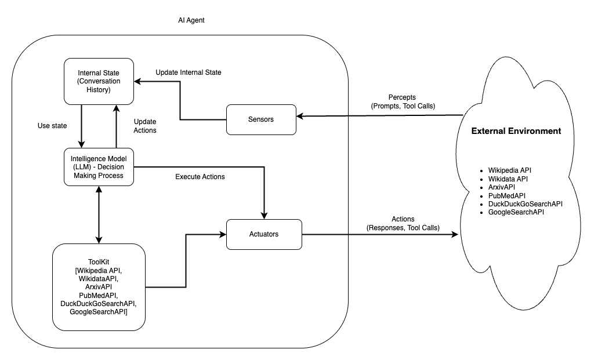
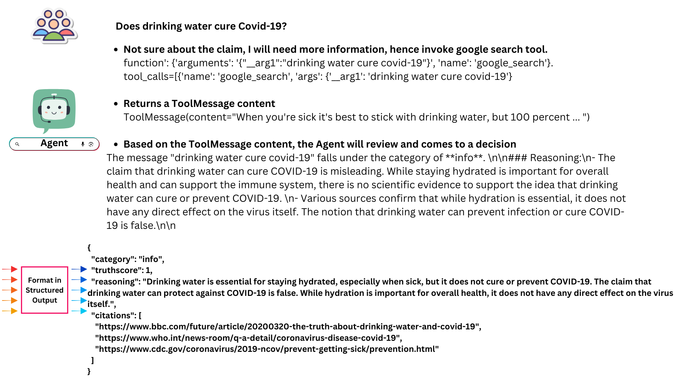
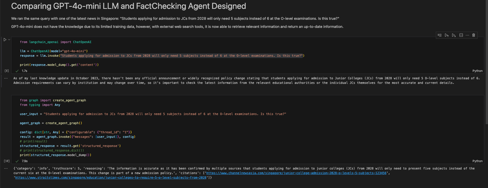

# FactChecking MultiAgentic System 

## Introduction of Agents
By definition, an agent is anything that can be viewed as perceiving its environment through sensors and acting upon that environment through actuators.

The app consists of an agent (LLM) and multiple web search tools. Whenever a new message is received, the agent will be first called to decide if we should use tools. Based on the agent (LLM) decision, it will run a loop:
1. If the agent said to take an action (i.e. call tool via API), we will run the tools and pass the results back to the agent
2. If the agent did not ask to run tools, we will finish (respond to the user)

After which, with all the information gathered, it then makes a judgement and provides its reasoning behind its judgement.

This closely relates to how fackcheckers works. When performing fact-checking, professionals typically start by closely reviewing the original claim or message. They then research the information online or consult reliable sources to gain domain-specific knowledge or context. Equipped with the insights gathered from their research, combined with their existing understanding of the topic, fact-checkers evaluate the accuracy of the claim. Finally, they respond to users with a clear conclusion and provide a concise justification based on their findings.

Agent architecture:
<p align="center">
  </img>
</a>
</p>

Therefore, the agentic workflow can be illustrated as below:
<p align="center">
  </img>
</a>
</p>

## Benefits of Agentic Workflow
One of the most common pitfalls of LLMs are that LLMs highly succumb to hallucinations, by just asking it to fact check without any references or knowledge base, it will result in inaccurate and hallucinated results. In addition, knowledge sources of LLMs have a cut-off date. The training data for GPT-4o-mini model is limited to data from October 2023 or earlier, hence, they do not have up-to-date information, resulting in a lower accuracy of fact-checking responses. 

Hence, by providing it with real-time Search API that can allow agents to receive up-to-date information. 
<p align="center">
  </img>
</a>
</p>

This shows that Agentic framework with relevant Web search tools will reduce hallucinations from LLM and return up-to-date information to users. 

## Setup and Installation 
1. Clone the repository
```
git clone https://github.com/weiyuan12/TechFest-25.git
cd TechFest-25/genai
```

2. Configure the Environment Variables

Create a `.env` file in the genai folder to configure variables for the genAI backend. Populate the `.env` file with the following variables:
```
OPENAI_API_KEY=
GOOGLE_API_KEY=
GOOGLE_CSE_ID=
LANGFUSE_PUBLIC_KEY=
LANGFUSE_SECRET_KEY=
LANGFUSE_HOST=
```

3. Set up Python Virtual Environment
```
# Create virtual environment
python3.12 -m venv .venv

# Activate virtual environment
source .venv/bin/activate

# Pip install all required libraries
pip install -r requirements.txt
```

4. To run the application
```
python3 server.py
```